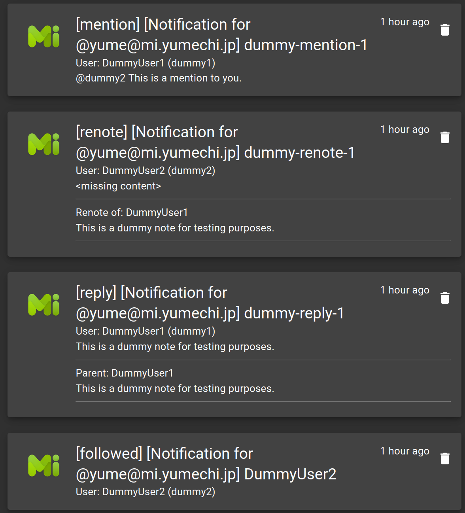

# gotify-website-misskey

Gotify Misskey Webhook Bridge



## Usage

1. Enable the plugin, set the webhook slugs:

```yaml
sources:
- slug: yumechi-no-kuni
  name: mi.yumechi.jp
  secret: xxxx
- slug: misskey-io
  name: misskey.io
  secret: xxxx
```

2. Copy the Webhook URL and secret to Misskey (Settings -> Webhook) Set the WebHook URL to receive any of 'replied to', 'renoted', 'mentioned', 'followed' (reactions seem to have bugs upstream and nothing is received)

3. Done! The on-click URL for notifications will also be populated when there is an User or Note associated with the notification.

## Notes

- The mockup webhook call payload is incorrect, the actual payload is different. This is an upstream issue. Please test with a real event for now for the message to be generated correctly.

## License

Apache 2.0
